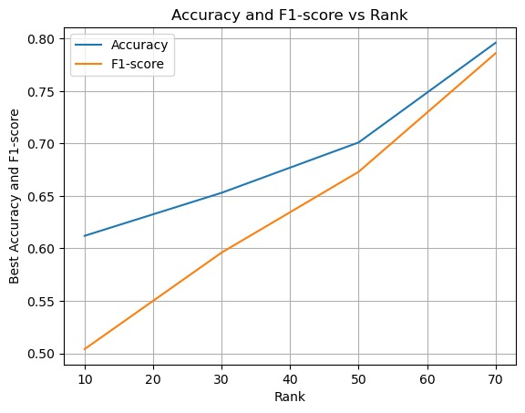

### Alicia Rakotonirainy & Pierre Boscherel

```{r}
# Load packages 
library(rTensor)
library(abind)
library(stringr)
library(RGCCA)
library(dplyr)
library(MASS)
library(caret)


# Load data
art = read.csv("data/art.csv", sep=";", row.names = 1)
port = read.csv("data/port.csv", sep=";", row.names = 1)
vein = read.csv("data/vein.csv", sep=";", row.names = 1)
tard = read.csv("data/tard.csv", sep=";", row.names = 1)
labels = read.csv("data/label.csv", sep=";", row.names = 1)
```


# Introduction

In this project, we analyzed data from liver cancer patients. Liver cancer is the third leading cause of cancer death worldwide. It is often detected too late for chirurgical treatment. Diagnosis can be made using medical imaging, especially for patient "at risk", for instance those with liver cirrhosis. A constrast medium is injected to the patient, and the 3D signal of the tumor is measured through time. Quantitative parameters, known as radiomics features, are extracted from those images, at 4 given time points (arterial, portal, veinal and tardive phase). We had access to 107 radomics features at 4 time points, for 147 different tumors. 

Liver cancer can be divided into 3 types : hepatocellular carcinoma, cholangiocarcinoma and mixed tumor. Those 3 types have very dstinct prognostics and treatment procedures, but their imaging aspect is very similar. It is therefore hard to distinguish them based on imaging data.

The goal of this project is to try to classify those 3 tumor types based on radiomics data extracted at 4 time points.

First, we analyzed the features at each time point as separated blocks. We performed an RGCCA analysis, and we performed an LDA on the latent components in order to separate the 3 classes. 

Then, we exploited the tensor shape of the data by performing a Tucker decomposition, and tried to observe cluster of samples thanks to this low dimensional factorization. We did a similar analysis using a PARAFAF decomposition. 

Lastly we compared those analyses with traditional Machine Learning classifiers, that do not use the tensor shape of the data.

# Data preprocessing

First, we preprocessed the data. We scaled each block so that each feature has mean 0 and standard deviation 1. We also replaced the NaN values by the mean of the column.

```{r}
art = read.csv("data/art.csv", sep=";", row.names = 1)
port = read.csv("data/port.csv", sep=";", row.names = 1)
vein = read.csv("data/vein.csv", sep=";", row.names = 1)
tard = read.csv("data/tard.csv", sep=";", row.names = 1)
labels = read.csv("data/label.csv", sep=";", row.names = 1)

# preprocess the data
reorder <- function(data) {
  # reorder samples so that we have first all the CCK, then all CHC, then all Mixtes
  reorder.samples = c(rownames(data)[142], 
                      rownames(data)[1:106],
                      rownames(data)[143:145], 
                      rownames(data)[107:141], 
                      rownames(data)[146:147])
  data = data[reorder.samples,]
  return(data)
}

preprocess <- function(data) {
  
  data = reorder(data)
  
  # preprocessing : make all values as floats
  data[data == "#N/A"] = NA
  data <- data %>% 
    mutate_all(funs(str_replace(., ",", ".")))
  data <- as.data.frame(sapply(data, as.numeric))
  
  # replace NA values by column mean
  for(i in 1:ncol(data)){
    data[is.na(data[,i]), i] <- mean(data[,i], na.rm = TRUE)
  }
  
  # scale the data
  data = scale(data)
  
  return(data)
  
}

art_ext = t(data.matrix(preprocess(art)))
port_ext = t(data.matrix(preprocess(port)))
vein_ext = t(data.matrix(preprocess(vein)))
tard_ext = t(data.matrix(preprocess(tard)))

# extend the dimensions
dim(art_ext) = c(1, dim(art_ext)[1], dim(art_ext)[2])
dim(port_ext) = c(1, dim(port_ext)[1], dim(port_ext)[2])
dim(vein_ext) = c(1, dim(vein_ext)[1], dim(vein_ext)[2])
dim(tard_ext) = c(1, dim(tard_ext)[1], dim(tard_ext)[2])

# make 3D tensor
X = abind(art_ext, port_ext, vein_ext, tard_ext, along=1)
X = as.tensor(X)

# reorder the labels
labels = reorder(labels)

# create one hot labels
labels_onehot = data.frame(labels)
labels_onehot$CCK = 0
labels_onehot$CHC = 0
labels_onehot$Mixtes = 0
labels_onehot$CCK[which(labels_onehot$labels == "CCK")] = 1
labels_onehot$CHC[which(labels_onehot$labels == "CHC")] = 1
labels_onehot$Mixtes[which(labels_onehot$labels == "Mixtes")] = 1
labels_onehot = subset(labels_onehot, select = -c(labels) )
labels_onehot

```


# RGCCA

Regularized generalized canonical correlation analysis (RGCCA) is a generalization of regularized canonical correlation analysis to 3 or more sets of variables. The first step is to design the connection matrix, which encodes previous knowledge on the dataset. We chose to consider 4 blocks of data (samples x features at 4 time points), plus the block corresponding to the labels. The features blocks are the "predictor" blocks, and the labels are the "response" block. There is not correlation between the predictor blocks, and they are all connected to the response block.


```{r}
# preprocess the data, without extending the dimension
art = preprocess(art)
port = preprocess(port)
vein = preprocess(vein)
tard = preprocess(tard)

# Create list of data + labels
X_data = list()
X_data$art = art
X_data$port = port
X_data$vein = vein
X_data$tard = tard
X_data$y = labels_onehot

# Define connection matrix
C = matrix(c(0, 0, 0, 0, 1, 
               0, 0, 0, 0, 1,
               0, 0, 0, 0, 1,
               0, 0, 0, 0, 1,
               1, 1, 1, 1, 0), 5, 5)
C
```

Now, we fit RGCCA :

```{r}
tau = c(1, 1, 1, 1, 0)

fit.rgcca = rgcca(X_data, connection = C, tau = tau, init = "random", 
                    ncomp = 2, tol = 1e-16, 
                    verbose = FALSE)
```

Next, we train a classifier on the first component of each of the 4 blocks. We chose to use LDA to project the data into a space where the classes are separable :

```{r}
latent_data = data.frame(art1 = fit.rgcca$Y$art[,1],
                           port1 = fit.rgcca$Y$port[,1],
                           vein1 = fit.rgcca$Y$vein[,1],
                           tard1 = fit.rgcca$Y$tard[,1],
                           y = labels)
  
  
X.lda <- lda(y ~ ., data=latent_data)
X.lda.values <- predict(X.lda)
```

We compute the F1 score associated to this classification. We chose the F1 score as a measure of classification performance in order to take into account class imbalances :

```{r}
compute_f1 <- function(y_pred, y_true){
  cm <- as.matrix(confusionMatrix(y_pred, y_true))
  n = sum(cm) # number of instances
  nc = nrow(cm) # number of classes
  rowsums = apply(cm, 1, sum) # number of instances per class
  colsums = apply(cm, 2, sum) # number of predictions per class
  diag = diag(cm)  # number of correctly classified instances per class 
  precision = diag / colsums 
  recall = diag / rowsums 
  f1 = 2 * precision * recall / (precision + recall) 
  f1[is.nan(f1)] <- 0
  macrof1 = mean(f1)
  return(macrof1)
}

print(compute_f1(X.lda.values$class, factor(labels)))
```

The F1 score is 0.34. It is very low. When we plot the LDA components for the 3 different classes, we see that there is no separation between the classes :

```{r}

ldahist(data = X.lda.values$x[,1], g=factor(labels))
plot(X.lda.values$x[,1],X.lda.values$x[,2], col=factor(labels))
```

Similarly, the factorial plan of the RGCCA latent component does not seem to separate the different classes. Below, we plot only the first component for the blocks 1 & 2 and 3 & 4, but this is a same for the other combinations : 

```{r}
plot(fit.rgcca, type= "sample", comp = 1, block = c(1,2),
     title = "Factorial plan of RGCCA - Blocks 1 & 2", resp = labels)
```

```{r}
plot(fit.rgcca, type= "sample", comp = 1, block = c(3,4),
     title = "Factorial plan of RGCCA - Blocks 3 & 4", resp = labels)
```


We obtained poor results with RGCCA. 
We also tried sGCCA and an LDA classification, which increased the performance : 

```{r}
# We try several values of sparsity and choose the best one
f1_list = c()
for (s in c(0.1, 0.15, 0.2, 0.3, 0.4, 0.5, 0.6, 0.9)){
    fit.sgcca = rgcca(X_data, connection = C, method = "sgcca", sparsity = c(s, s, s, s, 1), 
                      ncomp = c(2, 2, 2, 2, 1), scheme = "centroid", verbose = FALSE)
    
    # train a classifier on the 4 first components of the 4 blocks
    latent_data = data.frame(art1 = fit.sgcca$Y$art[,1],
                             port1 = fit.sgcca$Y$port[,1],
                             vein1 = fit.sgcca$Y$vein[,1],
                             tard1 = fit.sgcca$Y$tard[,1],
                             y = labels)
    
    
    X.lda <- lda(y ~ ., data=latent_data)
    X.lda.values <- predict(X.lda)
    # prediction based on LDA
    # pct of correct classification (but imbalanced with CHC...)
    macrof1 = compute_f1(X.lda.values$class, factor(labels))
    f1_list = c(f1_list, macrof1)
}
f1_list
```

The best F1 score is 0.57, which was achieved using a sparsity of 0.1 for all the 4 blocks.

# TUCKER Decomposition

The Tucker decomposition decomposes a tensor into a core tensor multiplied by a matrix along each mode. 

Let denote as $X$ the tensor of data, of the form : features x time x individuals.

We are looking for 2 matrices $A_1$ and $A_2$ of size $n_{features} \times J_1$ and $J_2 \times n_{times}$ respectively, such that : 

$X \sim F \times_1 A_1 \times_2 A_2$

where $\times_n$ is the $n$-mode product, and $F$ is a core tensor of size $J_1 \times J_2 \times n_{individuals}$.

To find such decomposition, we use the higher order orthogonal iteration (HOOI) algorithm (we iterate truncation and SVD until convergence). 

Once the core tensor $F$ is found, we can use its components as latent features for each individuals, and train a classifier on top of these new features. In fact here, we just performed a T-sne dimension reduction of the latent space (in order to visualize it into 2D), to see if the classes can be separated or not. We found that there is no separation between the classes, therefore we did not train the classifier.

```{r}
# Lets first define the Tucker-2 decomposition, using HOOI algorithm :

tucker_2 <- function(tnsr,ranks=NULL,max_iter=25,tol=1e-5){
  stopifnot(is(tnsr,"Tensor"))
  if(is.null(ranks)) stop("ranks must be specified")
  
  #initialization via truncated hosvd
  num_modes <- length(ranks)
  U_list <- vector("list",num_modes) # empty list of size num_modes
  for(m in 1:num_modes){
    temp_mat <- rs_unfold(tnsr,m=m)@data # unfold tensor on mode m
    U_list[[m]] <- svd(temp_mat,nu=ranks[m])$u
  }
  tnsr_norm <- fnorm(tnsr)
  curr_iter <- 1
  converged <- FALSE
  #set up convergence check
  fnorm_resid <- rep(0, max_iter)
  CHECK_CONV <- function(Z,U_list){
    est <- ttl(Z,U_list,ms=1:num_modes)
    curr_resid <- fnorm(tnsr - est)
    fnorm_resid[curr_iter] <<- curr_resid
    if (curr_iter==1) return(FALSE)
    if (abs(curr_resid-fnorm_resid[curr_iter-1])/tnsr_norm < tol) return(TRUE)
    else{return(FALSE)}
  }
  #progress bar
  pb <- txtProgressBar(min=0,max=max_iter,style=3)
  #main loop (until convergence or max_iter)
  while((curr_iter < max_iter) && (!converged)){
    setTxtProgressBar(pb,curr_iter)	
    modes_seq <- 1:num_modes
    # on obtient les memes U car 
    
    
    for(m in modes_seq){
      #core Z minus mode m
      X <- ttl(tnsr,lapply(U_list[-m],t),ms=modes_seq[-m]) # apply matrix product on all modes but m
      U_list[[m]] <- svd(rs_unfold(X,m=m)@data,nu=ranks[m])$u
    }
    #compute core tensor Z
    Z <- ttm(X,mat=t(U_list[[num_modes]]),m=num_modes)
    
    #checks convergence
    if(CHECK_CONV(Z, U_list)){
      print("Convergence after")
      print(curr_iter)
      print("iterations")
      converged <- TRUE
      setTxtProgressBar(pb,max_iter)	
    }else{
      curr_iter <- curr_iter + 1
    }
  }
  close(pb)
  #end of main loop
  #put together return list, and returns
  fnorm_resid <- fnorm_resid[fnorm_resid!=0]
  norm_percent<-(1-(tail(fnorm_resid,1)/tnsr_norm))*100
  est <- ttl(Z,U_list,ms=1:num_modes)
  invisible(list(Z=Z, U=U_list, conv=converged, est=est, norm_percent = norm_percent, fnorm_resid=tail(fnorm_resid,1), all_resids=fnorm_resid))
}

```

We first compute the Tucker decomposition, using a latent space size of 1 (for the times) and 30 (for the radiomics features). We plot the frobenius norm of the difference between the estimation based on this factorization and the true tensor of data :

```{r}
tucker2 = tucker_2(X, c(1,30))
est <- ttl(tucker2$Z,tucker2$U,ms=1:2)
fnorm(X - est)
```

Now, we compute a T-Sne dimension reduction on top of the latent features : 

```{r}

library(tsne)
library(plotly)

# Make a dataframe with the latent features
nfeatures = tucker2$Z@modes[1] *  tucker2$Z@modes[2]
tucker_df = data.frame(matrix(ncol = nfeatures, nrow = 147))
colnames(tucker_df) = 1:nfeatures

for (n in 1:147) {
  slice = tucker2$Z@data[,,n]
  slice = as.vector(slice)
  tucker_df[n,] = slice
}
tucker_df


```

```{r}
# Plot the T-SNE
set.seed(0)
tsne <- tsne(tucker_df, initial_dims = 2)
tsne <- data.frame(tsne)
pdb <- cbind(tsne,labels)

tsne_plot <- data.frame(x = pdb$X1, y = pdb$X2, col = labels)
ggplot(tsne_plot) + geom_point(aes(x=x, y=y, color=col)) + ggtitle("T-SNE - Tucker decomposition")
```

We do not see any separation between the different classes. We tried to change the size of the latent space, but we did not obtain any better result.

# PARAFAC

We tried a more constraint version of the Tucker decomposition, and namely the PARAFAC (where the core tensor has to be hyperdiagonal). 

For this part, we implemented it in a python notebook given in the `src/` folder (see GitHub repository). It uses the parafac method form the tensorly library combined with a PLS regression. The results are very good and we can see in the graph below the evolution of the accuracy as a function of the rank of the factorization. We notice that the accuracy becomes very good when we increase the rank in the PARAFAC algorithm. For each rank we tried to optimize the accuracy by setting thresholds on the prediction vectors outputed by the algorithm.




# Classical classifiers

To compare the performances of more advanced techniques on multivariate data, we also wanted to look at the performances of more classical classifiers. Therefore, we looked at the accuracy for the classification of the three types of cancer with the following algorithms: Random Forest, and SVM. 

Again, we implemented those methods in the same python notebook as the PARAFAC method, which is provided in the  `src/` folder. 

We see that the performances in terms of accuracy and F1 score are much lower than with the PARAFAC method used before. Indeed we have for the SVM an accuracy of 0.43 and F1-score of 0.48. For the Random Forest, we have an accuracy of 0.53 and F1-score of 0.49. It demonstrates that using more advanced techniques and tensors leads to better results. 


# Conclusion

To come back to the goal of the project which was to classify tumor types based on radiomics data extracted at 4 time points, we chose to implement several techniques that exploit the tensor shape of the data.

As a conclusion, it appears that it is not an easy task and classical classifiers are not performing very well. However, when using tensor based method such as the PARAFAC method, we obtained better results in terms of accuracy for the prediction task. 


